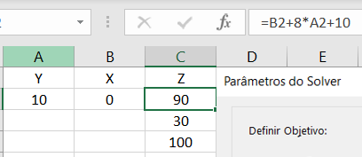
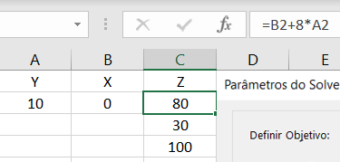

Exercício 4
=

## O que muda se a função objetivo não tiver o termo constante, ou seja, se z = x + 8y?

----

 

Neste caso, tomando a solução base no Excel, constata-se apenas que o valor da função objetivo se altera, mantendo-se os valores encontrados nos PPL e PPI. Na imagem abaixo é possível, notar o uso da função objetivo com o formato z = x + 8y + 10.

 

 

Em seguida, considerando a retirada do termo constante da função objetivo, e constata-se que as coordenadas de X e Y obtidas anteriormente se mantém. Porém, altera-se o valor da função objetivo

